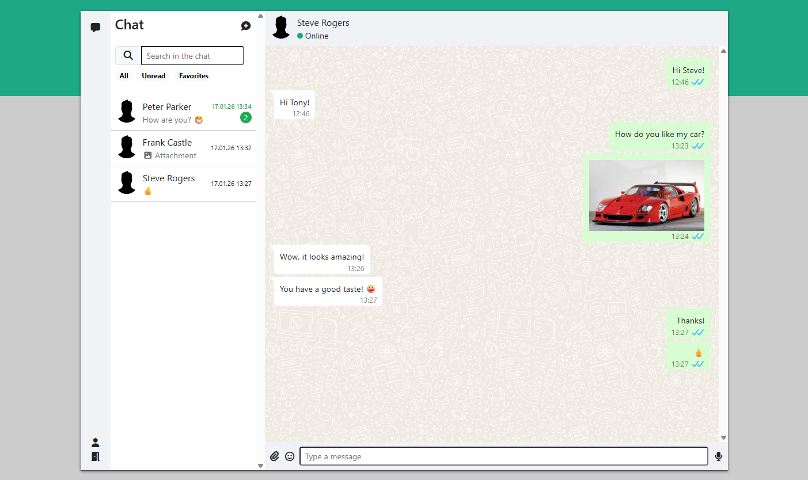
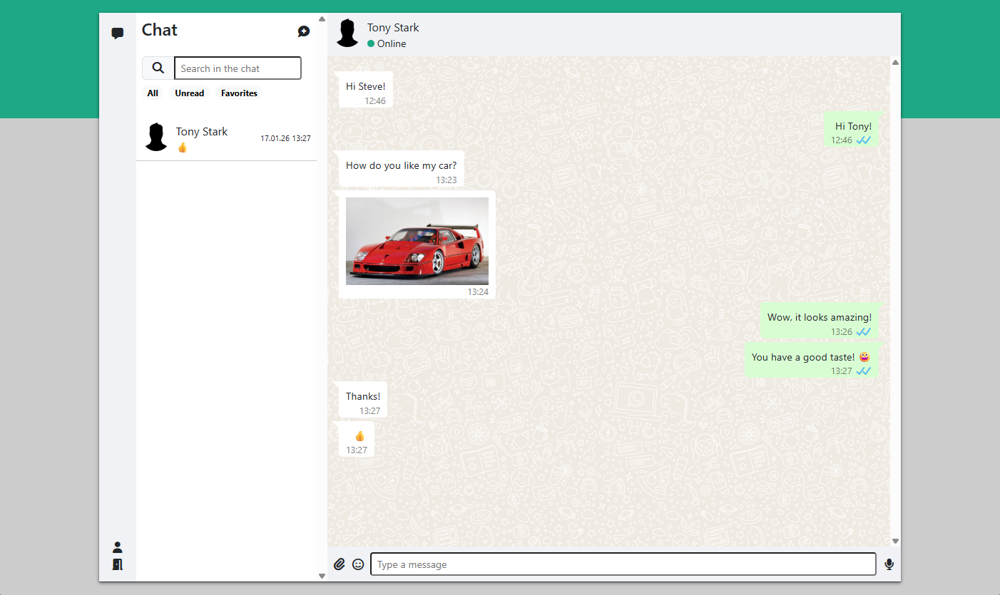
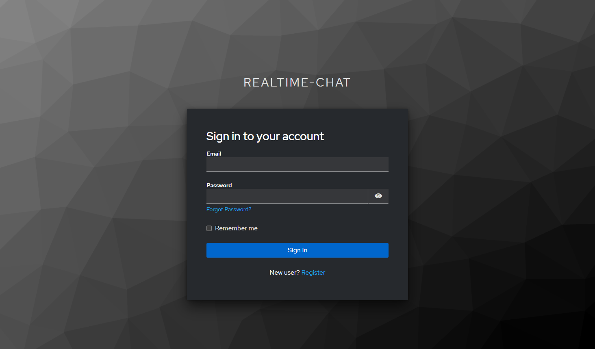
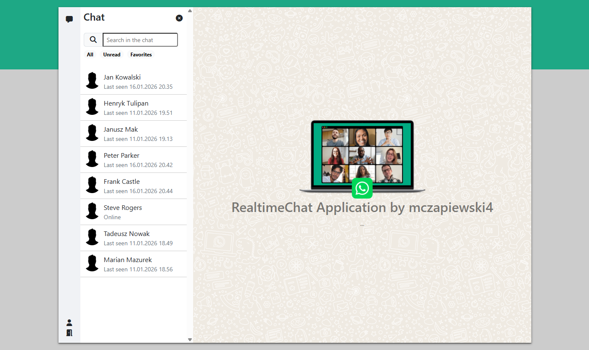
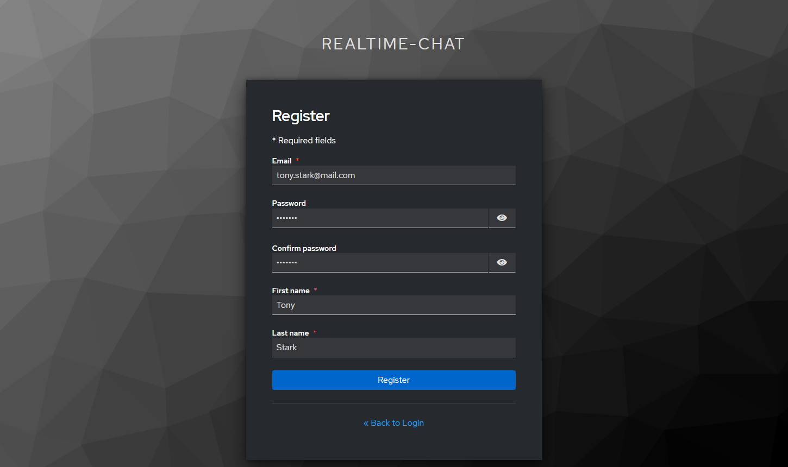
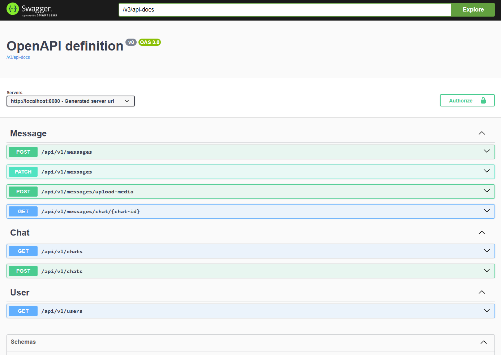

# RealtimeChat

A full-stack, real-time messaging application built to replicate core WhatsApp functionalities. The system uses a secure, scalable architecture combining Spring Boot 3, Angular 19, and Keycloak for identity management.





## 🚀 Technologies

The project is built using the following technologies and libraries:

* **Backend:** Java 21, Spring Boot 3 (Web, Security, Data JPA, WebSocket), OpenAPI (Swagger)
* **Frontend:** Angular 19, TypeScript, Bootstrap 5 (CSS), Keycloak JS
* **Database:** PostgreSQL
* **Identity & Security:** Keycloak (OAuth2)
* **Containerization:** Docker

## 🌟 Features

The application offers a rich set of features for real-time communication and secure access:

### 1. Secure Authentication (Keycloak)
Security is handled by an external Identity Provider.
* **Login:** Users are redirected to a secure Keycloak login page.
* **Registration:** New users can create accounts via the self-registration flow.
* **Token Management:** Access tokens are validated by the Spring Security Resource Server.



### 2. Real-Time Messaging & Media
The core functionality relies on WebSockets (STOMP) for instant data transfer.
* **Text Messages:** Instant delivery with status updates.
* **Media:** Support for sending Images files.
* **Message States:** Real-time feedback: `SENT` and `SEEN`.
* **Interactivity:** Emoji support via `@ctrl/ngx-emoji-mart`.

## 📷 Screenshots

### User Discovery
A list of all registered users allows you to start new conversations immediately.


### Account Registration
The registration process is fully integrated with the Keycloak identity server.


### API Documentation (Swagger UI)
The backend exposes a comprehensive REST API, documented automatically. You can test endpoints for file uploads and message history.


## ⚙️ Configuration & Installation

### Prerequisites
* Docker & Docker Compose
* Java Development Kit (JDK) 21
* Node.js (v18+) & npm

### Infrastructure Configuration (Docker)

The project includes a `docker-compose.yaml` file to run the necessary services.

1.  Start the services (PostgreSQL and Keycloak):
    ```bash
    docker-compose up -d
    ```
2.  **Service Ports:**
    * **PostgreSQL:** `localhost:5433` (Internal: 5432)
    * **Keycloak:** `localhost:8090` (Internal: 8080)

### Keycloak Setup

1.  Access the console at `http://localhost:8090`.
2.  Log in with `admin` / `admin`.
3.  Create a Realm named **`realtime-chat`**.
4.  Create a public Client for the frontend (Redirect URI: `http://localhost:4200/*`).

### Running the Application

**1. Backend**
Configure `src/main/resources/application.yaml` if your Docker ports differ. Then run:
```bash
./mvnw spring-boot:run
```

**2. Frontend**
Navigate to the frontend directory:

```bash
npm install
npm serve
```

Open your browser and navigate to: `http://localhost:4200`.
